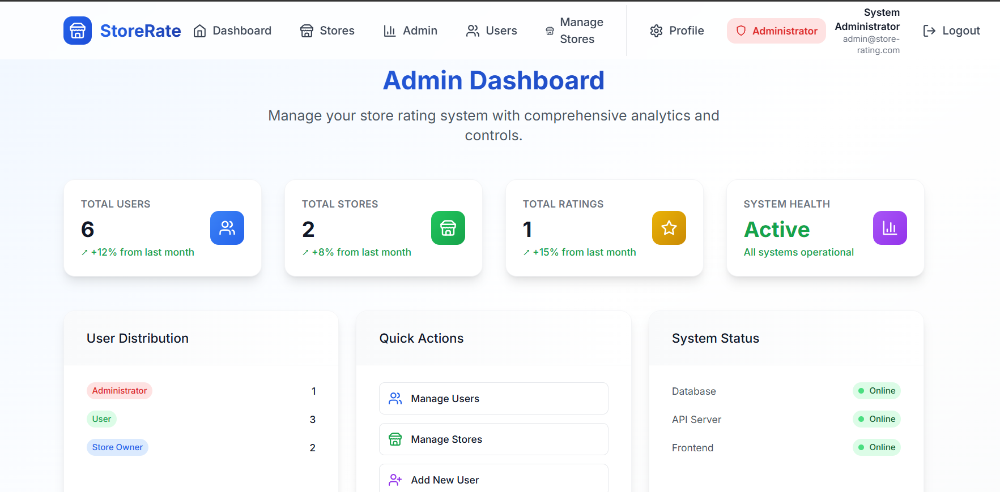
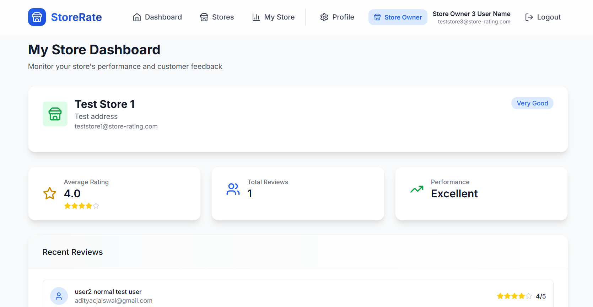
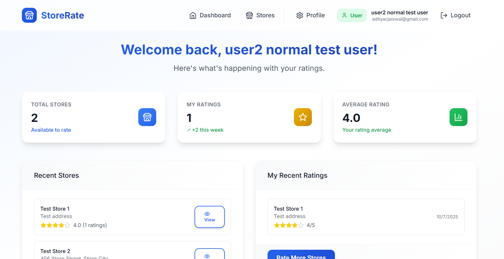
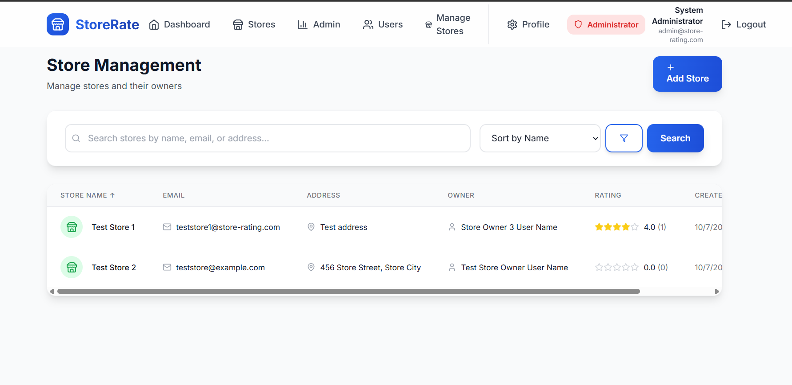

# Store Rating System

A comprehensive full-stack web application that allows users to submit ratings for stores with role-based access control. Built with Express.js, React.js, and PostgreSQL.

## 🚀 Features

### User Roles
- **System Administrator**: Full system control and management
- **Normal User**: Browse stores and submit ratings
- **Store Owner**: Monitor store performance and reviews

### Key Functionalities

#### System Administrator
- ✅ Complete user management (add, edit, delete users)
- ✅ Store management (add, edit, delete stores)
- ✅ Dashboard with system statistics and analytics
- ✅ User role management and assignment
- ✅ Advanced filtering and sorting capabilities
- ✅ Real-time activity monitoring
- ✅ Store ownership assignment
- ✅ Comprehensive system overview

#### Normal User
- ✅ User registration and authentication
- ✅ Browse and search stores with advanced filters
- ✅ Submit and modify store ratings (1-5 stars)
- ✅ View store details and all ratings
- ✅ Personal profile management
- ✅ Password updates and security
- ✅ View personal rating history
- ✅ Store discovery and exploration

#### Store Owner
- ✅ Dedicated store performance dashboard
- ✅ View customer reviews and ratings
- ✅ Real-time average rating monitoring
- ✅ Detailed review analytics and insights
- ✅ Performance status tracking
- ✅ Customer feedback management
- ✅ Store statistics and metrics

## 📸 Screenshots

### System Administrator Dashboard

*Comprehensive system overview with user management, store statistics, and real-time activity monitoring*

### Store Owner Dashboard

*Dedicated dashboard showing store performance, customer reviews, and analytics*

### User Interface

*Clean and intuitive interface for browsing stores and submitting ratings*

### Store Management

*Advanced store management with filtering, sorting, and detailed store information*

## 🛠️ Tech Stack

### Backend
- **Framework**: Express.js ^4.18.2
- **Database**: PostgreSQL ^8.11.3
- **Authentication**: JWT (JSON Web Tokens) ^9.0.2
- **Security**: bcryptjs ^2.4.3, helmet ^7.0.0, express-rate-limit ^6.10.0
- **Validation**: express-validator ^7.0.1
- **HTTP Client**: Axios ^1.12.2

### Frontend
- **Framework**: React.js ^18.2.0
- **Routing**: React Router DOM ^6.8.1
- **Styling**: Tailwind CSS ^3.2.7
- **Forms**: React Hook Form ^7.43.1
- **HTTP Client**: Axios ^1.3.4
- **Notifications**: React Toastify ^9.1.1
- **Icons**: Lucide React ^0.263.1
- **Utilities**: clsx ^1.2.1, tailwind-merge ^1.10.0

## 📋 Prerequisites

- Node.js (v14 or higher)
- PostgreSQL (v12 or higher)
- npm or yarn

## 🎯 Features Showcase

### 🔐 Role-Based Access Control
- **Three distinct user roles** with different permissions and interfaces
- **Secure authentication** with JWT tokens
- **Protected routes** based on user roles
- **Dynamic navigation** that adapts to user permissions

### 📊 Advanced Analytics & Dashboards
- **Admin Dashboard**: System-wide statistics, user management, store analytics
- **Store Owner Dashboard**: Store-specific performance metrics, customer feedback
- **User Dashboard**: Personal rating history, store discovery

### ⭐ Comprehensive Rating System
- **5-star rating system** with visual feedback
- **Real-time rating updates** and calculations
- **Rating history tracking** for users
- **Performance analytics** for store owners

### 🔍 Advanced Search & Filtering
- **Multi-criteria search** across stores and users
- **Sorting capabilities** by various fields
- **Pagination** for large datasets
- **Role-based data filtering**

## 🚀 Installation & Setup

### Quick Start (Automated Setup)
```bash
# Clone the repository
git clone https://github.com/AdityaCJaiswal/store-rating-system-rbac
cd store-rating-system-rbac

# Run automated setup
npm run setup
```

### Manual Setup

#### 1. Clone the Repository
```bash
git clone <repository-url>
cd store-rating-system-rbac
```

#### 2. Install Dependencies
```bash
# Install backend dependencies
npm install

# Install frontend dependencies
cd client
npm install
cd ..
```

#### 3. Database Setup

##### Create PostgreSQL Database
```sql
CREATE DATABASE store_rating_db;
```

##### Run Database Schema
```bash
psql -U your_username -d store_rating_db -f config/schema.sql
```

#### 4. Environment Configuration

Create a `.env` file in the root directory:

```env
NODE_ENV=development
PORT=5000
DB_HOST=localhost
DB_PORT=5432
DB_NAME=store_rating_db
DB_USER=your_db_user
DB_PASSWORD=your_db_password
JWT_SECRET=your_jwt_secret_key_here
JWT_EXPIRE=7d
```

#### 5. Start the Application

##### Development Mode
```bash
# Start backend server
npm run dev

# In a new terminal, start frontend
cd client
npm start
```

##### Production Mode
```bash
# Build frontend
npm run build

# Start production server
npm start
```

## 🔐 Default Admin Account

The system comes with a default admin account:
- **Email**: admin@store-rating.com
- **Password**: Admin123!

## 📖 Usage Guide

### For System Administrators
1. **Login** with admin credentials
2. **Access Admin Dashboard** to view system statistics
3. **Manage Users** - Create, edit, delete users and assign roles
4. **Manage Stores** - Create stores and assign store owners
5. **Monitor Activity** - View recent ratings and system activity
6. **Role Management** - Change user roles as needed

### For Store Owners
1. **Login** with store owner credentials
2. **Access Store Dashboard** to view store performance
3. **Monitor Ratings** - View customer reviews and feedback
4. **Track Performance** - Monitor average ratings and trends
5. **Analyze Data** - Review detailed analytics and insights

### For Regular Users
1. **Register** a new account or login
2. **Browse Stores** - Search and filter available stores
3. **View Store Details** - See store information and ratings
4. **Submit Ratings** - Rate stores with 1-5 stars
5. **Manage Profile** - Update personal information and password
6. **View History** - Track your rating history

## 📊 Database Schema

### Users Table
- `id` (Primary Key)
- `name` (20-60 characters)
- `email` (Unique)
- `password` (Hashed)
- `address` (Max 400 characters)
- `role` (admin, user, store_owner)
- `created_at`, `updated_at`

### Stores Table
- `id` (Primary Key)
- `name`
- `email` (Unique)
- `address` (Max 400 characters)
- `owner_id` (Foreign Key to Users)
- `created_at`, `updated_at`

### Ratings Table
- `id` (Primary Key)
- `user_id` (Foreign Key to Users)
- `store_id` (Foreign Key to Stores)
- `rating` (1-5)
- `created_at`, `updated_at`
- Unique constraint on (user_id, store_id)

## 🔒 Security Features

- **Password Hashing**: bcryptjs with salt rounds
- **JWT Authentication**: Secure token-based auth
- **Rate Limiting**: API request throttling
- **Input Validation**: Comprehensive form validation
- **SQL Injection Protection**: Parameterized queries
- **CORS Configuration**: Cross-origin request handling
- **Helmet**: Security headers

## 📱 API Endpoints

### Authentication
- `POST /api/auth/register` - User registration
- `POST /api/auth/login` - User login
- `GET /api/auth/profile` - Get user profile
- `PUT /api/auth/password` - Update password

### Users
- `GET /api/users` - Get all users (with filtering, sorting, pagination)
- `GET /api/users/:id` - Get user by ID
- `PUT /api/users/:id` - Update user
- `DELETE /api/users/:id` - Delete user

### Stores
- `GET /api/stores` - Get all stores (with filtering, sorting, pagination)
- `GET /api/stores/:id` - Get store by ID with ratings
- `POST /api/stores` - Create store (admin only)
- `PUT /api/stores/:id` - Update store
- `DELETE /api/stores/:id` - Delete store (admin only)

### Ratings
- `POST /api/ratings/:storeId` - Submit/update rating (users only)
- `GET /api/ratings/:storeId` - Get store ratings (store owner/admin only)
- `GET /api/ratings/:storeId/user` - Get user's rating for store
- `GET /api/ratings/user/all` - Get user's all ratings
- `DELETE /api/ratings/:storeId` - Delete user's rating

### Admin
- `GET /api/admin/dashboard` - Admin dashboard statistics
- `POST /api/admin/users` - Create user (admin only)
- `POST /api/admin/stores` - Create store (admin only)
- `GET /api/admin/users` - Get users with detailed analytics
- `GET /api/admin/stores` - Get stores with detailed analytics
- `PUT /api/admin/users/:id/role` - Update user role

### Store Owner
- `GET /api/store-owner/dashboard` - Store owner dashboard data

## 🎨 UI/UX Features

- **Responsive Design**: Mobile-first approach
- **Modern UI**: Clean, professional interface
- **Role-based Navigation**: Dynamic menu based on user role
- **Real-time Feedback**: Toast notifications
- **Loading States**: Smooth user experience
- **Form Validation**: Client and server-side validation
- **Accessibility**: Keyboard navigation and screen reader support

## 🔍 Form Validations

### Name
- Minimum: 20 characters
- Maximum: 60 characters

### Address
- Maximum: 400 characters

### Password
- Length: 8-16 characters
- Must contain: At least one uppercase letter
- Must contain: At least one special character

### Email
- Standard email format validation

## 📈 Performance Features

- **Pagination**: Efficient data loading
- **Sorting**: Multi-column sorting support
- **Filtering**: Advanced search and filter options
- **Caching**: Optimized database queries
- **Lazy Loading**: Component-based code splitting

## 🧪 Testing & Quality Assurance

The application includes comprehensive validation and error handling:

- **Input Validation**: Client and server-side validation
- **Database Constraints**: Data integrity enforcement
- **Authentication**: JWT token validation and role-based access
- **Error Handling**: Comprehensive error boundaries and user feedback
- **Form Validation**: Real-time validation with user-friendly messages
- **Security Testing**: Password hashing, SQL injection protection
- **API Testing**: Endpoint validation and error responses

## 🔧 Troubleshooting

### Common Issues

#### Database Connection Issues
```bash
# Check PostgreSQL service
sudo service postgresql status

# Restart PostgreSQL
sudo service postgresql restart
```

#### Port Already in Use
```bash
# Kill process on port 5000
lsof -ti:5000 | xargs kill -9

# Or use different port
PORT=3001 npm start
```

#### Frontend Build Issues
```bash
# Clear npm cache
npm cache clean --force

# Delete node_modules and reinstall
rm -rf node_modules package-lock.json
npm install
```

#### Environment Variables
- Ensure `.env` file exists in root directory
- Check database credentials are correct
- Verify JWT_SECRET is set

## 🚀 Deployment

### Environment Variables for Production
```env
NODE_ENV=production
PORT=5000
DB_HOST=your_production_db_host
DB_PORT=5432
DB_NAME=store_rating_db
DB_USER=your_production_db_user
DB_PASSWORD=your_production_db_password
JWT_SECRET=your_strong_jwt_secret
JWT_EXPIRE=7d
```

### Build for Production
```bash
# Build React app
cd client
npm run build

# The build folder will be served by Express.js
```

## 📁 Project Structure

```
store-rating-system-rbac/
├── client/                     # React frontend
│   ├── public/                # Static assets
│   ├── src/
│   │   ├── components/        # Reusable components
│   │   ├── pages/            # Page components
│   │   ├── contexts/         # React contexts
│   │   ├── config/           # Configuration files
│   │   └── utils/            # Utility functions
│   └── package.json
├── config/                    # Database configuration
│   ├── database.js           # Database connection
│   └── schema.sql            # Database schema
├── middleware/                # Express middleware
│   ├── auth.js              # Authentication middleware
│   └── validation.js        # Validation middleware
├── routes/                   # API routes
│   ├── auth.js              # Authentication routes
│   ├── users.js             # User management routes
│   ├── stores.js            # Store management routes
│   ├── ratings.js           # Rating system routes
│   ├── admin.js             # Admin-specific routes
│   └── store-owner.js       # Store owner routes
├── server.js                 # Express server
├── setup.js                  # Automated setup script
└── package.json              # Backend dependencies
```

## 🎯 Key Features Implemented

### ✅ Authentication & Authorization
- JWT-based authentication
- Role-based access control (Admin, User, Store Owner)
- Password hashing with bcryptjs
- Protected routes and middleware

### ✅ User Management
- User registration and login
- Profile management
- Role assignment and management
- User search and filtering

### ✅ Store Management
- Store creation and management
- Store owner assignment
- Store search and filtering
- Store analytics and statistics

### ✅ Rating System
- 5-star rating system
- Real-time rating updates
- Rating history tracking
- Performance analytics

### ✅ Dashboard & Analytics
- Admin dashboard with system statistics
- Store owner dashboard with performance metrics
- User dashboard with personal data
- Real-time data updates

## 📝 License

This project is licensed under the MIT License.

## 🤝 Contributing

1. Fork the repository
2. Create a feature branch (`git checkout -b feature/amazing-feature`)
3. Commit your changes (`git commit -m 'Add some amazing feature'`)
4. Push to the branch (`git push origin feature/amazing-feature`)
5. Open a Pull Request

---

**Built with ❤️ by Aditya Jaiswal**
